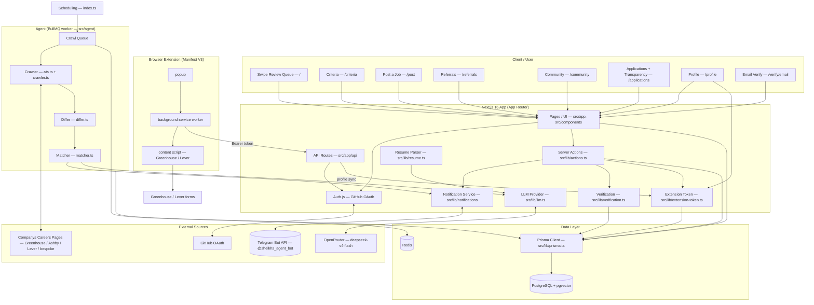

# Jobtwin — Architecture

```mermaid
flowchart TB
    subgraph CLIENT["Client / User"]
        SWIPE["Swipe Review Queue — /"]
        CRITERIA["Criteria — /criteria"]
        POST["Post a Job — /post"]
        REFERRAL["Referrals — /referrals"]
        COMMUNITY["Community — /community"]
        APPS["Applications + Transparency — /applications"]
        PROFILE["Profile — /profile"]
        VERIFY["Email Verify — /verify/email"]
    end

    subgraph EXT["Browser Extension (Manifest V3)"]
        POPUP["popup"] --> BG["background service worker"]
        BG --> CONTENT["content script — Greenhouse / Lever"]
    end

    subgraph WEB["Next.js 16 App (App Router)"]
        AUTH["Auth.js — GitHub OAuth"]
        ACTIONS["Server Actions — src/lib/actions.ts"]
        PAGES["Pages / UI — src/app, src/components"]
        API["API Routes — src/app/api"]
        NTFY["Notification Service — src/lib/notifications"]
        VERIF["Verification — src/lib/verification.ts"]
        EXTOK["Extension Token — src/lib/extension-token.ts"]
        LLM["LLM Provider — src/lib/llm.ts"]
        RESUME["Resume Parser — src/lib/resume.ts"]
    end

    subgraph AGENT["Agent (BullMQ worker — src/agent)"]
        QUEUE[Crawl Queue]
        CRAWLER["Crawler — ats.ts + crawler.ts"]
        DIFFER["Differ — differ.ts"]
        MATCHER["Matcher — matcher.ts"]
    end

    subgraph DATA["Data Layer"]
        PRISMA["Prisma Client — src/lib/prisma.ts"]
        DB[("PostgreSQL + pgvector")]
        REDIS[("Redis")]
    end

    subgraph SRC["External Sources"]
        CAREERS["Companys Careers Pages — Greenhouse / Ashby / Lever / bespoke"]
        TELEGRAM[("Telegram Bot API — @sheikhs_agent_bot")]
        OPENROUTER["OpenRouter — deepseek-v4-flash"]
        GITHUB_OAUTH["GitHub OAuth"]
    end

    %% Client → Web
    SWIPE & CRITERIA & POST & REFERRAL & COMMUNITY & APPS & PROFILE & VERIFY --> PAGES
    PAGES --> AUTH
    PAGES --> ACTIONS

    %% Auth
    AUTH <--> GITHUB_OAUTH

    %% Server actions → libraries
    ACTIONS --> NTFY
    ACTIONS --> VERIF
    ACTIONS --> EXTOK
    RESUME --> LLM

    %% API routes / extension
    API --> AUTH
    PROFILE --> EXTOK
    BG -->|"Bearer token"| API
    API -->|"profile sync"| EXTOK
    CONTENT --> C_FORM["Greenhouse / Lever forms"]

    %% Agent flow
    SCHED["Scheduling — index.ts"] --> QUEUE
    QUEUE --> CRAWLER
    CRAWLER <--> CAREERS
    CRAWLER --> DIFFER
    DIFFER --> MATCHER
    MATCHER --> NTFY
    MATCHER --> LLM

    %% Data
    PAGES --> PRISMA
    ACTIONS --> PRISMA
    AGENT --> PRISMA
    VERIF --> PRISMA
    EXTOK --> PRISMA
    PRISMA --> DB
    QUEUE --> REDIS

    %% LLM + notify
    LLM <--> OPENROUTER
    NTFY <--> TELEGRAM
```
